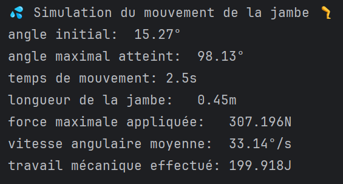
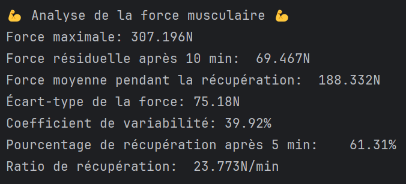

# Travail Pratique 1: 420-SN1-RE Automne: Analyse Biomécanique

## Objectifs
− Comprendre et appliquer les opérations arithmétiques (chapitre 1)  
− Comprendre et appliquer les fonctions d’affichage (chapitre 1)  
− Utiliser des fonctions de bibliothèques importées (chapitre 2)  

## Pondération
10 % de la note finale.
Le travail comprend trois parties valant chacune 10 points, pour un total de 30 points.
La note finale sera calculée en divisant le total des points obtenus par 3.

## Équipes
Travail à faire en équipe de 2 ou 3. Aucun travail individuel n’est accepté. **Un travail solo ne sera pas  
corrigé et se verra attribuer la note de 0.**

## Remise
Le travail doit être remis via GitHub Classroom; les remises par LÉA ne sont pas acceptées. La date de remise sera  
communiquée par LÉA et sera aussi inscrite dans Github Classroom.

À noter que l'utilisation de Git permet de faire des remises partielles au fur et à mesure de l'avancement du travail.

# Travail à faire
## Contexte
En physiothérapie, l’analyse biomécanique permet d’évaluer les forces, les angles et les vitesses impliqués dans les  
mouvements du corps humain. Ce TP simule un test de flexion-extension du genou, utilisé pour mesurer la performance  
musculaire et la récupération après effort.

## Prérequis
- Créer un environnement virtuel Python (si ce n'est pas déjà fait)
  - Suivre les instructions dans la section **Optionnel, mais recommandé: Configurer un environnement virtuel** du README.MD du dépôt [420-SN1-RE-A25](https://github.com/plducharme/420-SN1-RE-A25)
    - Ne pas committer l'environnement virtuel dans le dépôt.
- Votre code doit être dans le fichier `simulation.py` qui vous est fourni votre dépôt généré par Github Classroom.
- Inscrire le nom des membres de l'équipe, no de DA et nom d'utilisateur github dans l'espace prévu à cet effet dans le fichier `simulation.py`.

## Partie 1: Simulation du mouvement (10 points)
### Objectifs
- Utiliser la bibliothèque `random` pour générer des variables aléatoires.
  - Vous devez importer la bibliothèque `random` pour la partie 1
- Utiliser la bibliothèque `math` pour effectuer des conversions d'unités.
  - Vous devez importer la bibliothèque `math` pour la partie 1
On cherche à calculer et afficher:
- l'amplitude du mouvement de flexion-extension du genou.
  - L'amplitude est la différence entre l'angle maximal et l'angle minimal atteint pendant le mouvement.
- La vitesse angulaire moyenne du mouvement.
  - La vitesse angulaire moyenne est calculée en divisant l'amplitude par le temps total du mouvement.
- Le travail mécanique effectué pendant le mouvement.
  - Le travail mécanique est calculé en multipliant la force appliquée par la distance parcourue.
    - La distance parcourue peut être approximée en utilisant l'amplitude du mouvement et la longueur du segment de la jambe.

### Variables à générer
- `angle_initial`: 
  - angle initial du genou en degrés
  - float aléatoire entre 0 et 20
  - doit être arrondi à deux décimales
- `angle_maximal_atteint`: 
  - angle maximal atteint pendant le mouvement en degrés
  - float aléatoire entre 90 et 130
  - doit être arrondi à deux décimales
- `temps_execution`: 
  - temps total du mouvement en secondes
  - float aléatoire entre 1.5 et 3.5
  - doit être arrondi à une décimale
- `force_maximale_appliquee`: 
  - force maximale appliquée pendant le mouvement en Newtons
  - float aléatoire entre 150 et 400
  - doit être arrondi à trois décimales

### Autres variables
- `longueur_segment_jambe`:
    - longueur du segment de la jambe en mètres
    - constante fictive de 0.45

### Code à réaliser
- Vous devez calculer les variables suivantes:
  - `amplitude_mouvement`: 
    - amplitude du mouvement en degrés
    - calculée comme la différence entre l'angle maximal et l'angle initial
  - `vitesse_angulaire_moyenne`: 
    - vitesse angulaire moyenne en degrés par seconde
    - calculée en divisant l'amplitude du mouvement par le temps total du mouvement
  - `travail_mecanique`: 
    - travail mécanique effectué pendant le mouvement en Joules
    - calculé en multipliant la force maximale appliquée par la distance parcourue
    - la distance parcourue est approximée en utilisant l'amplitude du mouvement (convertie en radians) et la longueur du segment de la jambe
    - utiliser la fonction `radians` de la bibliothèque `math` pour convertir l'amplitude du mouvement en radians
    - le travail mécanique doit être arrondi à trois décimales
- Vous devez afficher les résultats en reproduisant cette mise en forme:
  
  - la valeur unicode pour la sueur est `0001F4A6`
  - la valeur unicode pour la jambe est `0001F9B5`
  - il y a une tabulation avant chaque valeur
  - les unités doivent être affichées comme dans l'exemple
  - les valeurs doivent être arrondies tel qu'indiqué plus haut

## Partie 2 : Analyse de la récupération musculaire (10 points)
### Objectifs
- Utiliser NumPy pour calculer les statistiques de la récupération musculaire d'après le mouvement simulé en Partie 1.
- La simulation doit couvrir 10 minutes, avec une mesure de la force musculaire chaque minute.
- La force initiale est la force maximale appliquée lors du mouvement (voir Partie 1).
  - réutiliser la variable `force_maximale_appliquee` de la Partie 1.
- La force résiduelle finale est un float aléatoire entre 60 et 100 N, arrondi à 3 décimales.
- Générer un tableau NumPy représentant la diminution de la force musculaire chaque minute, de la force maximale à la force résiduelle.
  - On considère que la diminution de la force est linéaire sur les 10 minutes.
  - Vous devez utiliser la fonction `linspace` de NumPy pour générer les valeurs de force musculaire.
  - Vous devez utiliser la fonction round de NumPy pour arrondir les valeurs pour la partie 2 (pas celle de math).
- Vous devez importer NumPy avec l'alias `np`.
- Pour cette partie, vous devez nommer vous-même les variables que vous utilisez.
  - Les noms doivent être explicites et respecter les conventions de nommage en Python.
### Calculer à effectuer
  - La force maximale [N]
    - arrondie à 3 décimales
  - La force résiduelle après 10 minutes [N]
    - arrondie à 3 décimales
  - La force moyenne pendant la récupération [N]
    - arrondie à 2 décimales
  - L’écart-type de la force [N]
    - arrondi à 2 décimales
  - Le coefficient de variabilité [%] (écart-type / moyenne × 100)
    - arrondi à 2 décimales
  - Le pourcentage de récupération après 5 minutes [%] (force à 5 min / force maximale × 100)
    - arrondi à 2 décimales
  - Le ratio de récupération [N/min] ((force maximale - force résiduelle) / 10)
    - arrondi à 3 décimales

### Affichage
- Affichier les valeurs calculées en reproduisant cette mise en forme:
  
  - Il doit y avoir une ligne vide entre la Partie 1 et la Partie 2
  - la valeur unicode pour le muscle est `0001F4AA`
  - il y a une tabulation avant chaque valeur
  - les unités doivent être affichées comme dans l'exemple
  - les valeurs doivent être arrondies tel qu'indiqué plus haut

## Partie 3 : Visualisation de la récupération (10 points)
### Objectifs
- Utiliser Matplotlib pour produire le graphique demandé.
### Graphiques à produire
- Générer et afficher:
  - Une courbe de la force musculaire pendant les 10 minutes de récupération (utiliser les valeurs de la Partie 2).
    -  ex: 

## Évaluation
- Chaque partie sera évaluée sur 10 points selon les critères suivants:
  - Respect des consignes
  - Exactitude des calculs
  - Qualité du code (noms de variables, commentaires, structure)

